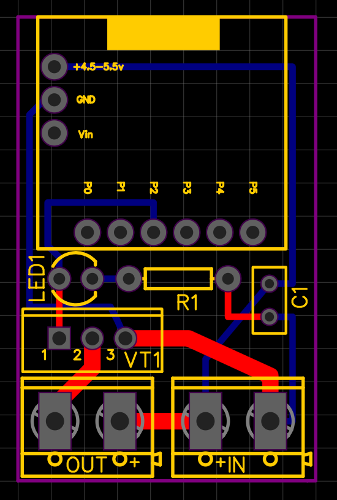

# plawas-m

## Plant watering system - Mini (PLAWAS-M)

This project based on [Digispark](http://digistump.com/wiki/digispark) with ATtiny85 (8-bit Microcontroller)

Current while Pump ON - 220 mA  
Current in Standby-mode - 14 mA

1-Schematic_Plawas-m.json
2-PCB.json 
This  two files for EasyEDA software.
I made one small circuit board for it

Photo how it looks now :)

